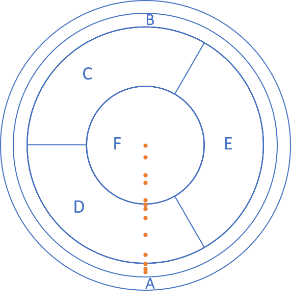

# Welcome to FAIR-UMN

Hey! There! 

This is the project web-page for our project---FAIR-UMN: Identifying Interaction Location inSuperCDMS Detectors.

In this project, we address the problem of accurately reconstruct the locations of interactions in theSuperCDMS detectors using machine learning methods. The approach is to use data collected with aradioactive source at known locations to train and qualify machine learning models.

## Detector and Data Description

### Detector Information

A prototype SuperCDMS germanium detector was tested at the University of Minnesota with a radioactive source mounted on a movable stage that can scan from the edge to the center of the detector. The detector is disk-shaped with sensors placed on the top and bottom surfaces to detect the particles emitted by the radioactive source, which is shown in Figure 1.

<figure></figure>
 
<figcaption>Figure 1: A SuperCDMS dark matter detector.</figcaption>

 
 
 

The sensors measure phonons (quantized vibrations of the crystal lattice) that are produced by the interacting particle and travel from the interaction location to the sensors. The number of phonons and the relative time of arrival at a particular sensor depends on the positions of the interaction and
the sensor. The sensors are grouped into six regions on each side of the detector and each of these “channels” produces a waveform for every interaction. For the test performed at Minnesota, five channels on one side of the detector were used (Figure 2). The movable radioactive source was used to produce interactions at thirteen different locations on the detector along a radial path from the central axis to close to the the detector’s outer edge (Figure 3).

<figure></figure>
  
<figcaption>Figure 2: Pulses from an interaction in a SuperCDMS detector.</figcaption>

### Data Description

<figure></figure>
 
<figcaption>Figure 3: nteraction locations included in the dataset.</figcaption>

 
 
 

<figure></figure>
  
<figcaption>Figure 4: Pulses timing and shape parameters.</figcaption>

## Machine Learning Solution

### Dataset for Machine Learning

<figure></figure>
  

### Deep Neural Network Model

<figure></figure>
  
<figcaption>Figure 5: The framework of deep neural network models.</figcaption>

### Results of Deep Neural Network Models

<figure></figure>
  

## Support or Contact

Having trouble with codes or setting up? Check out our [documentation](https://github.com/ml-deepai/FAIR-UMN/blob/main/doc/FAIR%20Document%20-%20Identifying%20Interaction%20Location%20in%20SuperCDMS%20Detectors.pdf) or [contact support](https://) and we’ll help you sort it out.
